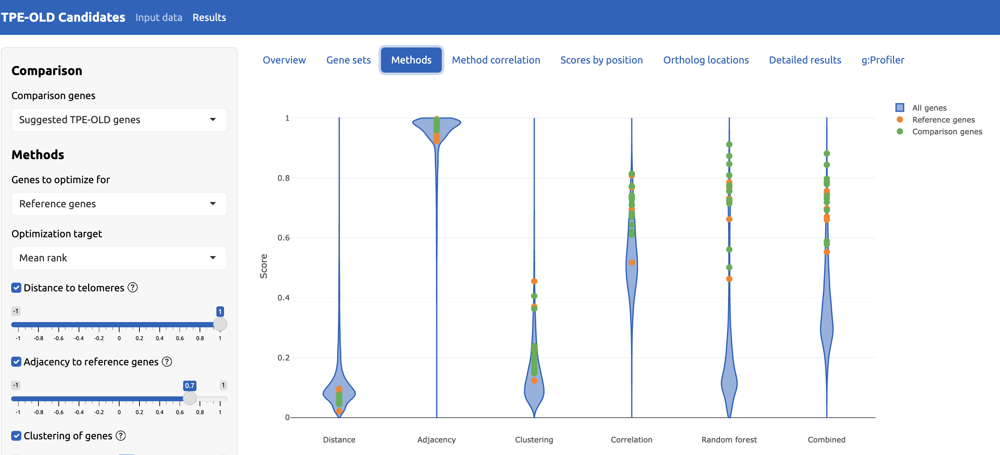

# geposan UI

This document describes the user interaction with the the geposan infrastructure as installed at <https://tpe-old.uni-rostock.de>.

## Motivation

The motivation to using this web interface is a ranking of any number of human genes for their presume association with the ends of chromosomes (telomeres). These are repetitive DNA sequences of tens of kBp in length that shorten with every cellular division. Much like a gene set enrichment analysis can yield terms of the Gene Ontology to be associated with a gene set, this tool yields a description about what genes in a preselection are associated with telomeres.

The regulation of an increasing number of genes has been reported to depend on the length of telomeres, those are said to be under a telomere position effect (TPE). The telomeres may fold back over large stretches of the chromosome, thus that the TPE can also be reported over long distances (TPE-OLD).

Information on TPE-OLD is still limited. With providing this tool we hope to direct the community towards those geens that may be more likely than others to experience a controlled telomeric interaction, based on the distance to the telomeres to appear evolutionary conserved.

## How to get help

If you use case does not match the scenarios outlined in this document then please create an issue on the GitHub project page: <https://github.com/smoe/geposanui/issues> . Please also be aware of the context-sensitive help made available via the "?" aside many options.

## Overall concept of GUI

Input data tab::
  The blue bar at the top introduces a separation of more systemic paramters of the heuristics. Most dominantly these are the
  * Species to include. 
    The web site uses all species in Ensembl with a minimal genome size.  When selecting "Customize" fromt the selection, another selection box opens for a selection of species of interest.
  * Reference genes. 
    Some heuristics will compare the chromosomal distance of a candidate gene to telomeres with the same of a set of reference genes for which an effect was already described. Those genes are then marked in orange in the plots of the results tab.
  
  Most users will not want to modify the settings of the 'input data tab'.
Results tab::
  * Overview 
    This is the landing page of the web site. The user specifies their genes of interest and for those genes the plots will indicate the ranking and/or details in the other tabs. Changing the input genes in the overview does not have an effect on the scoring of the genes, just the display of the green dots and the summary statistics will be affected.
  * Gene sets 
    Displays a bar pot for the scores of the user-selected genes and the reference genes.
  * Methods 
    Violin plots present for each heuristic ("method") the score distribution of all genes, user-selected genes marked in green.
  * Method correlation 
    The scores determined by arbitrary two methods (which are to be selected by the user) are shown as a scatter plot.
  * Scores by position
    - Overview 
      The overall score assigned for each gene is averaged by a density plot, all chromosomes are shown.
    - Individual chromosome selected 
      For all genes of the selected human chromosome, a scatter plot of the score against the distance in base pairs to the nearest end of the chromosome is plotted. All genes are show an can be identified with a mouse-over.
    - All chromsosomes 
      The scatter plot _score ~ telomeric distance_ is shown for genes of all 
  * Ortholog location 
    For all species contributing to the scoring, the telomeric distance of user-selected genes and reference genes is indicated.
  * Detailed results 
    The score of all genes are listed. The table is interactive, filters are prepared.
  * g:Profiler 
    Top-ranked genes, users specify the exact constraints, are submitted to g:Profiler and results are displayed in situ.

## Datails on species selection ("input data")

 
*Species selection:* By default, all species in Ensembl with a minimal genome size are included.

You are unlikely to need to change the selection of species for your purpose. If you disagree then please kindly drop us a note. Once we have more of an understanding on what combinations of species shall are considered important, other than "all", we would likely prepare such sets of species. When selecting "Customize" fromt the selection, another selection box opens for a selection of species of interest.

A basic requirement for the here aggregated heuristics to work is to have access to the functional and evolutionary equivalent genes, i.e. orthologs, in other species. The web site uses all species in Ensembl with a minimal genome size and at least 50% of its genes must be orthologous to the gene set already established. The quality of the assembly of a genome is thus important, since for yet unassembled fragments the distances to the ends of the chromosomes cannot be interpreted as a distance to a telomere.

It should also be noted that the number of orthologs depends on the set of species already selected.
We thus cannot prepare a blacklist of species.

## Details on selected tabs

### Overview

 
.*Overview:* The landing page of http://tpe-old.uni-rostock.de is also where the user-centric input (genes and weighting of heuristics) is specified.

Comparison genes:: The user selectes their genes of interest to be one of

* Random genes - to become familiar with the system without any biological input. 
* Established TPE-OLD genes - a set of seven genes for which a TPE-OLD effect was established.
* Suggested TPE-OLD genes - a set of another five genes for which a TPE-OLD effect is presumed likely but not yet wet-lab confirmed
* "Your genes" - a custom selection, to be performed in a then appearing selection box below. Most users will have this field as their only input.  

When selected, different means are offered to specify the gene set, specified via the upper selection box:

* HGNC Names - the official human gene names
* Ensembl IDs - as provided by <https://www.ensembl.org>

Genes to optimize for::
 As the weights of methods change, it naturally affects the scoring of genes, which is calculated as the weighted sum of scores obtained from each individual method. For the majority of users, the default setting will involve reference genes, carefully chosen to represent a specific biological feature of interest (highlighted in orange) - typically the TPE-OLD effect. However, users also have the option to submit a set of custom genes (highlighted in green). In such cases, to observe how the ranking is influenced by scoring prepared specifically for this custom gene set, the system provides the option for ad hoc optimization on the "Comparison genes".

Optmization target::
 The reference genes (default) or custom genes (if selected above) will be evaluated based on their scores, which are determined by the weights assigned to each method. This optimization process is carried out using a dedicated function in R that implements gradient descent (geraten, Elias?). Users have several options to guide this weight optimization:

* Mean rank: Aiming for the highest possible average score assignment.
* Median rank: Striving for optimal performance of the gene positioned in the middle.
* First rank: Prioritizing the best-performing gene.
* Last rank: Focusing on improving the performance of the worst-performing gene.
* Customized weights: Allowing users to adjust the weights according to their preferences.

#### Methods

 Distance to telomeres::
  The chromosomal distance of a gene to the nearest chromosome.
 Adjacency to reference genes::
  Another gene of the reference set has a similar distance.
 Clustering of genes::
  The distance of a gene to the telomere does not change much across many species.
 Correlation with reference genes::
  When (and only when) reference genes are close to the telomeres, so is this gene.
 Assessment by random forest::
  @Elias.

The sliders, i.e. the weighting of the contribution of the scores yielded by each method, are auto-adjusted but a custom setting is allowed if so selselected, as described above. If there is a method that is not to your liking then we suggest to set the weight of tha method to 0. How well the method is performing can be inspected by the plots presented in the Methods and Method correlaton tabs, explained below.

### Gene sets

 
.*Gene sets:* The bar plot show the scores of the user-selected genes and the reference genes. User-selected genes are marked in green, reference genes in orange, in blue the scores of all human genes are represented.

The page displays a bar plot to representt the scoring of human genes. A comparison of the user-selected scores with the scores of all genes also yields a P value by a Wilcoxon rank sum test. 

### Methods

 
.*Methods:* The violin plots present for each heuristic ("method") the score distribution of all genes, user-selected genes are marked in green.

The effect of the method on the scoring of the genes is shown as a violin plot. The user-selected genes are marked in green. The method is selected by the user and the sliders in the input data tab are auto-adjusted to the performance of the method. The user can also set the weight of the method to 0, if the method is not to their liking or to assess the contributio of an individual method to the overall score. The method is selected by the user and the sliders in the input data tab are auto-adjusted to the performance of the method.

The genes are represented by small dots and identify themseselves when the mouse pointer hovers over them. We consider those insights to be important for the user to chase up unexpected findings, e.g. genes with good scores that are remote to the telomeres.

### Method correlation

 
.*Method correlation:* The scores determined by arbitrary two methods (which are to be selected by the user) are shown as a scatter plot.

The user can choose between any two methods that shall determine the X and Y axes of a scatter plot. As for the other graphs, a mouse-over identifies the genes. We are particularly intrigued by the sudden changes to the gene density observed both at the upper and lower extrema of the scores.

### Scores by position

 
.*Overview on Scores by position for all chromosomes:* The combined score (as determined by the slider settings) is shown as a density plot for all the genes, separated by chromosomes. The centromere is indicated, the p-arm to the left, score on the Y axis.

 
.*_Score ~ Telomere distance_ for genes of an individual chromosome*: With a constraint of the display on a single chromosome, the individual genes are now identifiable by a mouse-over."

 
.*_Score ~ Telomere distance_ for all genes:* Same plot, accumulating data from all chromosomes.

### Ortholog location

 
.*Ortholog location:* The telomeric distance of user-selected genes and reference genes is indicated for all species contributing to the scoring.

### Detailed results

 
.*Detailed results:* Table of all human genes and their respective score. The table is interactive. Filters are made available to constrain the list to genes of particular interest.

### g:Profiler

 
.*g:Profiler:* The best-ranking genes can be filtered for their scores and telomeric distance, are then sent to g:Profiler to investigate enrichments.

Please remain aware that the genes selected for the plots of the _g:Profiler_ tab and the _detailed results_ are not depending on any set of custom genes that have been submitted but on the scoring. And that scoring is derived from the reference set of genes that affect the auto-adjustment of sliders.

## Technicalities

### Export of image data from plots

This web interface relies on JavaScript libraries of plotly for rendering the plots. The top-right of those plots present as series of modifying bars:

 

of which the most left is These offer an export a PNG.

### Export of data from tables

## References

A paper accompanying this development is currently under peer review. 

Software packages contributing to the web site are:

*[R](https://www.r-project.org) and its [libraries](https://cran.r-project.org)*

* [shiny](https://shiny.posit.co/) and associated developments
  * [shinyWidgets](https://cran.r-project.org/web/packages/shinyWidgets/)
  * [shinyjs](https://cran.r-project.org/web/packages/shinyjs/)
  * [shinyBS](https://cran.r-project.org/web/packages/shinyBS/)
  * [shinythemes](https://cran.r-project.org/web/packages/shinythemes/)
  * [shinydashboard](https://cran.r-project.org/web/packages/shinydashboard/)
  * [shinydashboardPlus](https://cran.r-project.org/web/packages/shinydashboardPlus/)
  * [shinyFiles](https://cran.r-project.org/web/packages/shinyFiles/)
  * [shinyalert](https://cran.r-project.org/web/packages/shinyalert/)
  * [shinybusy](https://cran.r-project.org/web/packages/shinybusy/index.html)
  * [shinyFeedback](https://cran.r-project.org/web/packages/shinyFeedback/vignettes/shinyFeedback-intro.html)
  * [shiny.semantic](https://cran.r-project.org/web/packages/shiny.semantic/)
* [ggplot2](https://ggplot2.tidyverse.org/)
* [gprofiler2](https://cran.r-project.org/web/packages/gprofiler2/index.html)
* [DT](https://rstudio.github.io/DT/) which wraps the JavaScript library DataTables

*JavaScript libraries*

* [plotly.js](https://plotly.com/javascript/)
* [DataTables](https://datatables.net/) together with [jQuery](https://jquery.com/)

## Acknowledgements

We thank all our users for their encouragement and feedback, special thanks go to our colleagues at the Institutes for https://ilab.med.uni-rostock.de/[Clinical Chemistry and Laboratory Medicine] and https://ibima.med.uni-rostock.de[Biostatics and Informatics in Medicine and Aging Research] in Rostock. The service is hosted on a cloud instance generously provided by the https://www.itmz.uni-rostock.de/[Rostock University ITMZ], for which we are grateful.